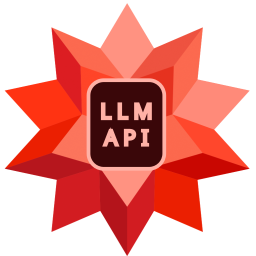

# WolframAlpha LLM MCP Server - Smithery Integration



A Model Context Protocol (MCP) server that provides access to WolframAlpha's LLM API. https://products.wolframalpha.com/llm-api/documentation

<a href="https://smithery.ai/server/@Garoth/wolframalpha-llm-mcp"></a>

## Installation via Smithery

To install WolframAlpha LLM Server for Claude Desktop automatically via [Smithery](https://smithery.ai/server/@Garoth/wolframalpha-llm-mcp):

```bash
npx -y @smithery/cli install @Garoth/wolframalpha-llm-mcp --client claude
```

## Manual Installation

For manual installation instructions, please refer to the [README.md](README.md) file.
